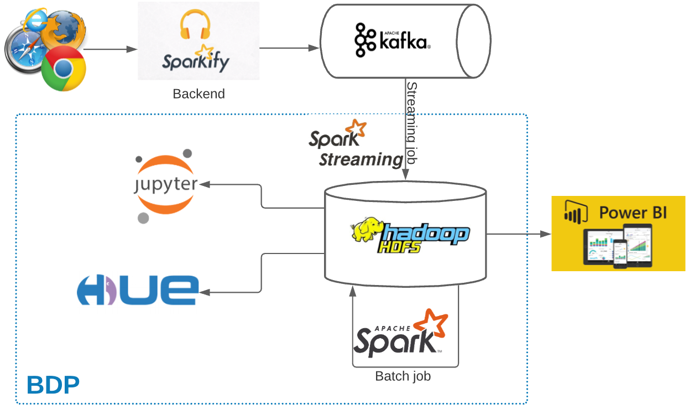

# Background and Motivation
Spakify is a music streaming sevice as similar to Spotify. Every users' activities on Sparkify application are logged and sent to Kafka cluster. To improve the business, the data team will collect data to a Big Data Platform for further processing, analysing and extracting insights info for respective actions. One of the focusing topic is churn user prediction. Detailed steps of how the problem is conducted in this [blog](https://vanducng.dev/2021/02/21/Churn-rate-prediction-on-Sparkify-service) and this [jupyter notebook](https://github.com/vdn-projects/sparkify/blob/main/jupyter/sparkify.ipynb).

Predicting churn rates is a challenging and common problem that data scientists and analysts regularly encounter in any customer-facing business. Additionally, the ability to efficiently manipulate large datasets with Spark is one of the highest-demand skills in the field of data. 

In this project, I'm going to build an end to end data pipeline starting with data streaming from Sparkify backend to Kafka cluster. There will be a dedicated Spark streaming application to consumer the stream message and ingest to Hadoop, stored as parquet format, and retrieved with HiveQL on HUE, or Spark SQL via Jupyter. There is another Spark Batch job to run the model after the experiment on Jyputer. The experiment focuses on the analyze and predict the factors impacting to churn rate. Further analysis can publish for regular reporting on PowerBI as denoted in below diagram.

The data pipeline looks as below:
    <p align="left">
        
    </p>

# Dataset
* This is a public dataset named `Million Song Dataset` and can be download under json format prepared by `Udacity` from [here](/data/medium-sparkify-event-data.json.gz)
* Contains 18 columns which has the information of customers(gender, name, etc.) and API events(login, playing next song, etc.)
* Experiment period: 2018–10–01 to 2018–12–01
* Kafka message example:
    ```json
    {
        "ts":1543621857000,
        "userId":"300011",
        "sessionId":500,
        "page":"NextSong",
        "auth":"Logged In",
        "method":"PUT",
        "status":200,
        "level":"paid",
        "itemInSession":37,
        "location":"New York-Newark-Jersey City, NY-NJ-PA",
        "userAgent":"Mozilla/5.0 (compatible; MSIE 9.0; Windows NT 6.1; WOW64; Trident/5.0)",
        "lastName":"House",
        "firstName":"Emilia",
        "registration":1538336771000,
        "gender":"F",
        "artist":"Olive",
        "song":"You\\'re Not Alone",
        "length":264.12363
    }
    ```

To use this Sparkify, user needs to register an account with free or paid. As a registered user, they can upgrade/downgrade from free/paid to paid/free level. User can also leave the platform by cancelling account.

# Setup prerequisites
To ensure the deployment comparability, ensure below packages are in same versions.

    sklearn 0.23.2
    confluent_kafka 1.0.1
    pyspark 2.4.1
    numpy 1.17.2
    pandas 0.24.2
    seaborn 0.10.1
    matplotlib 3.0.2


# Project files

- The data streaming part are referred to 2 other courses delivered by Udacity which are [Data Engineering](https://www.udacity.com/course/data-engineer-nanodegree--nd027) and [Data Streaming](https://www.udacity.com/course/data-streaming-nanodegree--nd029). The source code are prepared to parse the input `medium-sparkify-event-data.json` as message and streaming via Kafka.
- The main experiment for `Data Science` part is placed in jupyter folder, where you can find the data cleaning, exploration, modeling, fine tunning for the work on churn rating with Spark.

- The main project files and their respective functions listed as below:
    ```
    ├───app.cfg
    ├───logging.ini
    ├───deploy.sh
    ├───kafka_consumer.py
    ├───kafka_producer.py
    ├───producer_server.py
    ├───spark_streaming.py
    ├───data
    │   └───medium-sparkify-event-data.json.gz
    └───jupyter
        └───sparkify.ipynb
    ```

    * `logging.ini`: the config for logging of Spark applications
    * `app.cfg`: list out parameters used in the application (specific for Kafka and Spark).
    * `kafka_producer.py`: kafka producer script to send the kafka message
    * `producer_server.py`: kafka core service which is to parse the json file and produce by Confluence Producer class
    * `kafka_consumer.py`: kafka consumer script used for testing the message sent by `kafka_producer.py`
    * `spark_streaming.py`: the Spark streaming application which consumes message from Kafka, transform and store on HDFS
    * `medium-sparkify-event-data.json.gz`: json data should be unzip when start testing. 
    * `deploy.sh`: shell script to quicly deploy the Spark application to our Yarn cluster.

# How to run project
I used our available Yarn cluster with infrastructure supporting Kafka, Spark, Hadoop services. This can be achievable with 
[Amazon EMR - Big Data Platform](https://aws.amazon.com/emr/?whats-new-cards.sort-by=item.additionalFields.postDateTime&whats-new-cards.sort-order=desc).

- How to run the `Kafka producer`:
    * Extract the `medium-sparkify-event-data.json.gz` in data folder
    * Run `python kafka_producer.py --time_interval 1` to send every message per second

- How to run `Spark streaming application`:
    * At the current project, run `./deploy` script
    * It will submit our pyspark application to Yarn cluster and start consume message sent from Kafka.

- The running opration once executing above two commands can be seen as below:
    <p align="left">
        
    </p>

# Result summary
* The business problem to solve: predict churn rate
* The metrics selected for evaluating the result: `f1 score`. The churn rate in practice is dominant by non-churn ones (22% vs 78% for the provided dataset), `f1` is chosen because it is to balance the precision (predict right churn person) and recall (not to miss the churn person).
* Select machine learning algorithm: `Random Forest` as it provides better score comparing to other evalated ML algorithms `Logistic Regression` and `Gradient Boosted Trees`.
* `f1 score` = `0.87` which is fairly good.
* Top features contributing to `churn rate` are registered_days, rolling advert, etc. which are valuable information for product team to improve the service for better customer retention.

    <p align="left">
        
    </p>


# References
* https://medium.com/@nutanbhogendrasharma/role-of-stringindexer-and-pipelines-in-pyspark-ml-feature-b79085bb8a6c
* https://towardsdatascience.com/machine-learning-with-pyspark-and-mllib-solving-a-binary-classification-problem-96396065d2aa
* https://www.kdnuggets.com/2017/06/7-techniques-handle-imbalanced-data.html